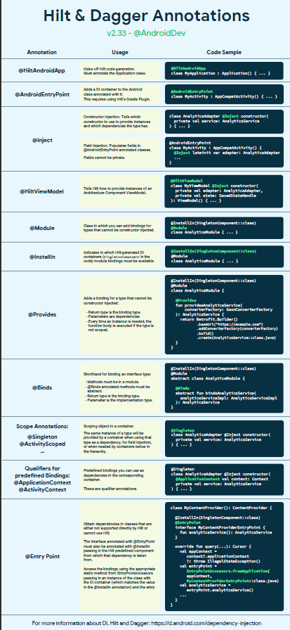

# Hilt Dependency Injection (DI)
<!-- <h3>The Dependency Injection (DI) via Hilt</h3> -->
<h2 align="center">To Connect Or Follow</h2>

<strong>
What is dependency injection and when/why should or shouldn't it be used?
</strong>

Dependency Injection is passing dependency to other objects or framework( dependency injector).
Dependency injection is basically providing the objects, the object needs (its dependencies) instead of having it construct them itself. It's a very useful technique for testing, since it allows dependencies to be mocked or stubbed out.

<h2> Some Factors To be counted</h2>

<strong>The Following factors exists if the dependecy injection is not done or implemented</strong>
 
<ol>
<li> Class is not testable </li>
<li> Code is not extensible </li>
<li> Single Responsibility </li>
<li> Lifetime of objects (Reusability) </li>
</ol>

<strong> These factors come into play when dependency injection is not implemented </strong>
 
<strong> with the help of dependecy injection, these factors are removed </strong>

<h2> Types Of Dependency Injection </h2>

<strong> There are 3 types of <i>Dependency Injection (DI):</i> </strong>
<ol>
<li>Constructor Injection</li>
<li>Method Injection</li>
<li>Property Injection (sometimes also said as field injection)</li>
</ol>

<h2> The Annotations and Usages </h2>

<h3>Clone the Code. It Contains the Dependency Injection Via Hilt</h3>
<h3>Also don't forget to read the comments in the code, they're helpful!!</h3>
